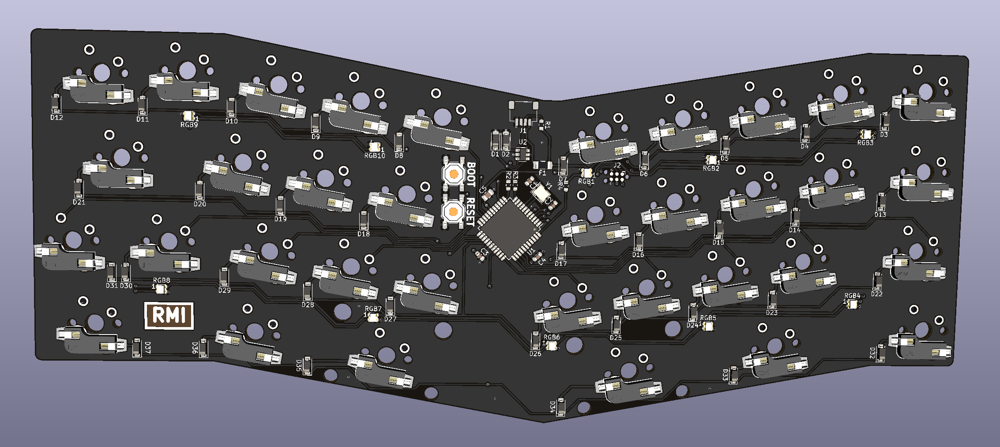

# C-13X-PCB

## Features

- ATmega32A
- ai03 daughterboard compatible
- Solder and Kailh hotswap compatible

## How to order

1. JLCPCB.com
2. Upload the gerber zip file from the `Gerbers` directory.
3. Select SMT assembly as an option.
4. Select the bottom side to assemble.
5. Upload the BOM and CPL files from the `JLCPCB` directory.
6. Place your order.
7. ???
8. Profit!

## After ordering

Once you've received the boards, you will have to flash a bootloader on it before being able to flash any QMK firmware on it.

Instructions for that can be found using [here](https://github.com/coseyfannitutti/discipline/blob/master/doc/bootloader/README.md).

## Flashing QMK firmware on it

TBD because I've yet to order boards for myself

## License

This has the same license as the C-13X. See the `LICENSE` file for more details.